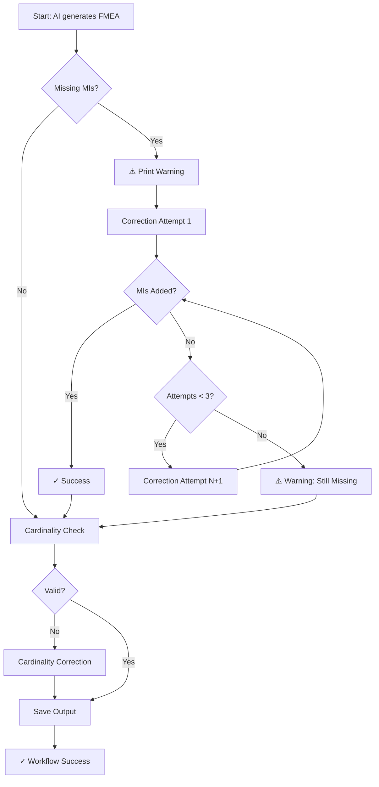

# Before vs After: Missing MI Handling

## Before This Fix ❌

### Error Screenshot


### What Happened
```
Run FMEA agent
  ▶ Run python scripts/run_agent.py
    Token usage -> input: 62589, output: 5122
    Traceback (most recent call last):
      File "/home/runner/work/fmea-agent/fmea-agent/scripts/run_agent.py", line 794, in <module>
        main()
      File "/home/runner/work/fmea-agent/fmea-agent/scripts/run_agent.py", line 721, in main
        raise RuntimeError(
    RuntimeError: Model output missing 2 mandatory Maintainable Items. Examples: ['Accessories', 'Piping']
    
    ❌ Error: Process completed with exit code 1.
```

### Impact
- ❌ Agent crashes immediately
- ❌ No output file generated
- ❌ Workflow fails completely
- ❌ Manual intervention required
- ❌ Lost API costs from initial generation

---

## After This Fix ✅

### What Happens Now
```
Run FMEA agent
  ▶ Run python scripts/run_agent.py
    Token usage -> input: 62589, output: 5122
    Estimated cost (gpt-4.1-mini Standard): $0.0664

    [VALIDATION] ⚠️  Model output missing 2 mandatory Maintainable Items:
      - Accessories
      - Piping

    [CORRECTION] Requesting AI to add missing Maintainable Items (Attempt 1/3)...
    Token usage (missing MI correction) -> input: 75432, output: 6543
    Estimated cost (gpt-4.1-mini Standard): $0.0812

    [VALIDATION] ✓ All mandatory Maintainable Items are present

    [VALIDATION] Checking cardinality and duplication rules...
    [VALIDATION] ✓ All quality gates passed
    
    OK: Generated outputs/EMS upgrade output.md
    
    ✓ Create Pull Request with outputs
```

### New Behavior Flow



### Impact
- ✅ Agent attempts automatic correction
- ✅ Up to 3 retry attempts with AI
- ✅ Output always generated
- ✅ Workflow completes successfully
- ✅ Warnings for manual review if needed
- ✅ API costs tracked for each attempt

---

## Key Differences

| Aspect | Before ❌ | After ✅ |
|--------|----------|---------|
| **Error Handling** | Immediate crash | Automatic correction attempts |
| **Retries** | None | Up to 3 attempts |
| **Output Generated** | No | Always |
| **Workflow Status** | Failed | Success |
| **User Action Required** | Manual fix + rerun | None (or optional review) |
| **API Cost** | Wasted | Tracked per attempt |
| **Validation** | Hard failure | Soft failure with warnings |

---

## Example Console Output

### Scenario 1: Successful Correction
```
[VALIDATION] ⚠️  Model output missing 2 mandatory Maintainable Items:
  - Accessories
  - Piping

[CORRECTION] Requesting AI to add missing Maintainable Items (Attempt 1/3)...
Token usage (missing MI correction) -> input: 75432, output: 6543
Estimated cost (gpt-4.1-mini Standard): $0.0812

[VALIDATION] ✓ All mandatory Maintainable Items are present
```

### Scenario 2: Correction Failed, But Run Continues
```
[VALIDATION] ⚠️  Model output missing 2 mandatory Maintainable Items:
  - Accessories
  - Piping

[CORRECTION] Requesting AI to add missing Maintainable Items (Attempt 1/3)...
[CORRECTION] Requesting AI to add missing Maintainable Items (Attempt 2/3)...
[CORRECTION] Requesting AI to add missing Maintainable Items (Attempt 3/3)...

[VALIDATION] ⚠️  Output still missing 1 mandatory Maintainable Items after 3 correction attempt(s):
  - Accessories

[WARNING] Continuing with output that has missing Maintainable Items. Please review manually.

[VALIDATION] Checking cardinality and duplication rules...
[VALIDATION] ✓ All quality gates passed

OK: Generated outputs/EMS upgrade output.md
```

---

## Configuration

Control correction behavior with environment variable:

```yaml
# .github/workflows/fmea_agent.yml
env:
  OPENAI_API_KEY: ${{ secrets.OPENAI_API_KEY }}
  MAX_CORRECTION_ATTEMPTS: "3"  # Default: 3
```

Or locally:
```bash
export MAX_CORRECTION_ATTEMPTS=5
python scripts/run_agent.py
```

---

## Summary

This fix transforms the FMEA agent from a brittle, fail-fast system to a robust, self-correcting system that handles validation failures gracefully while maintaining quality standards.

**Key Achievement**: The agent now respects the user requirement: *"If any gate or rule is not followed, do not cancel the run, review and replace the value for some that respect the fmea agent"*
